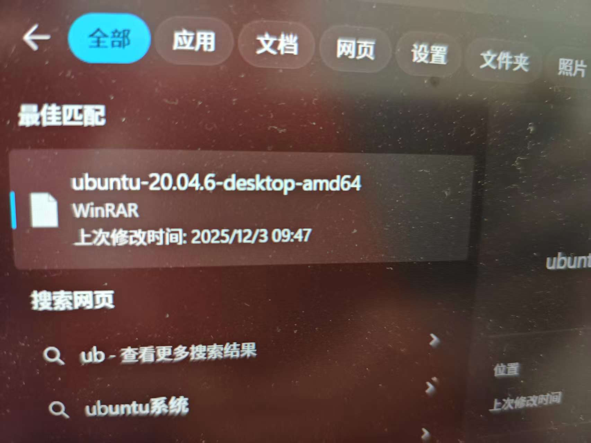
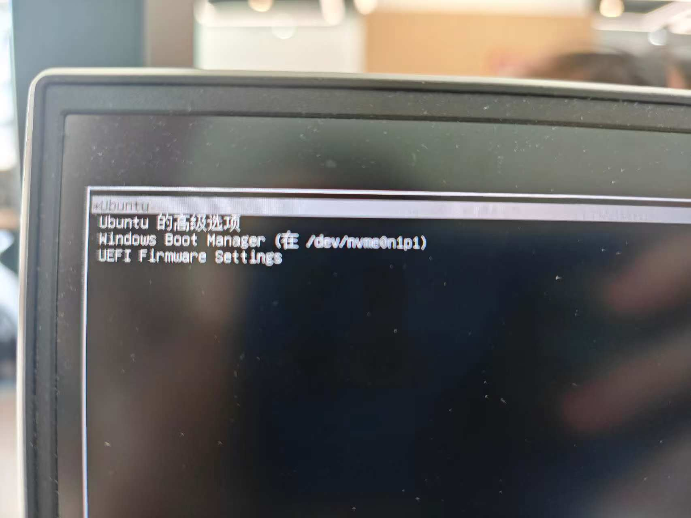
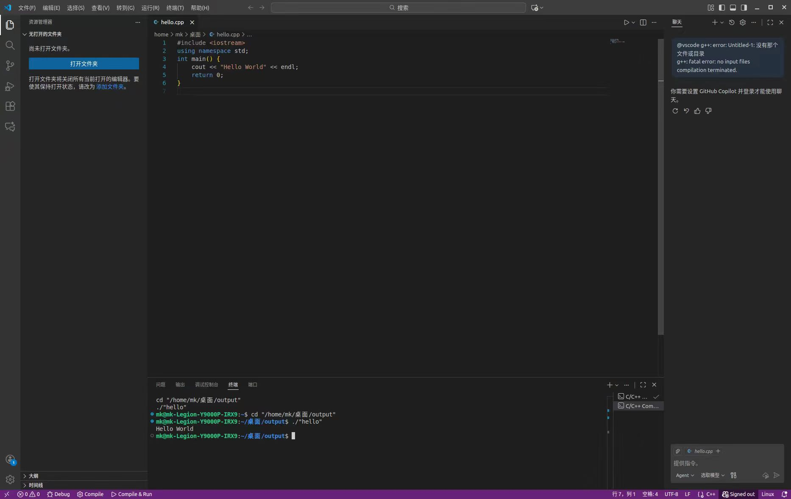
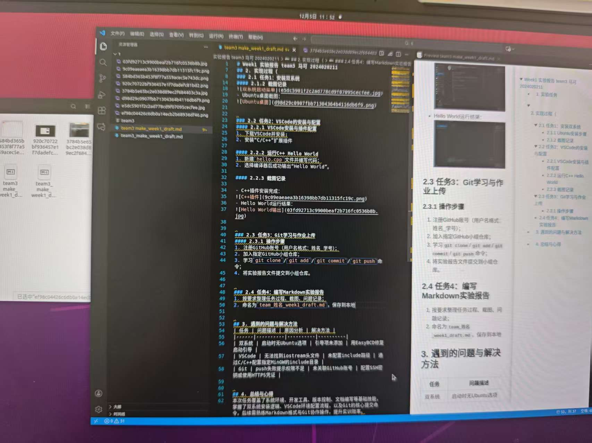

# Week1 实验报告 team3 马可 2024020211

## 1. 实验任务
完成双系统安装、VSCode配置、Git学习与作业上传、Markdown报告编写4项实训任务

## 2. 实现过程
### 2.1 任务1：安装双系统
#### 2.1.1 Ubuntu安装步骤
1. 准备Ubuntu镜像文件（官网下载）与U盘启动盘；
2. 进入Windows磁盘管理，划分空闲分区；
3. 从U盘启动，选择“安装Ubuntu”，按提示完成分区与安装

#### 2.1.2 截图记录
- Ubuntu安装完成截图：

- 双系统启动菜单截图：

- Ubuntu桌面截图：

### 2.2 任务2：VSCode的安装与配置
#### 2.2.1 VSCode安装与插件配置
1. 下载VSCode并安装;
2. 安装“C/C++”扩展插件

#### 2.2.2 运行C++ Hello World
1. 新建`hello.cpp`文件并编写代码；
2. 选择编译器后成功输出“Hello World”。

#### 2.2.3 截图记录

- C++插件安装完成：

- Hello World运行结果：

### 2.3 任务3：Git学习与作业上传
#### 2.3.1 操作步骤
1. 注册GitHub账号（用户名格式：姓名_学号）；
2. 加入指定GitHub小组仓库；
3. 学习`git clone`/`git add`/`git commit`/`git push`命令；
4. 将实验报告文件提交到小组仓库。

### 2.4 任务4：编写Markdown实验报告
1. 按要求整理任务过程、截图、问题记录；
2. 命名为`team_姓名_week1_draft.md`，保存到本地
   
#### 2.4.3 截图记录

- 制作markdown：

## 3. 遇到的问题与解决方法
 问题描述|解决方法|

|无法找到iostream头文件|通过C/C++配置include目录 |
| 未关联GitHub账号 | 配置SSH密钥或使用HTTPS凭证 |

## 4. 总结与心得
### 4.1 总结
1. 这周学了双系统安装、VSCode配置和Git基础，动手实操下来收获挺多。装Win11和Ubuntu双系统时，调BIOS设置、分区还有修复引导费了点劲，遇到过启动黑屏的情况，查资料试了几次才解决，总算摸清了双系统安装的关键步骤，切换系统也越来越顺手
### 4.2 心得
1. VSCode装完后加了C++插件，跟着步骤配置环境，成功跑通Hello World，感觉这个工具用着很方便，插件也能帮着提升效率
2. 

